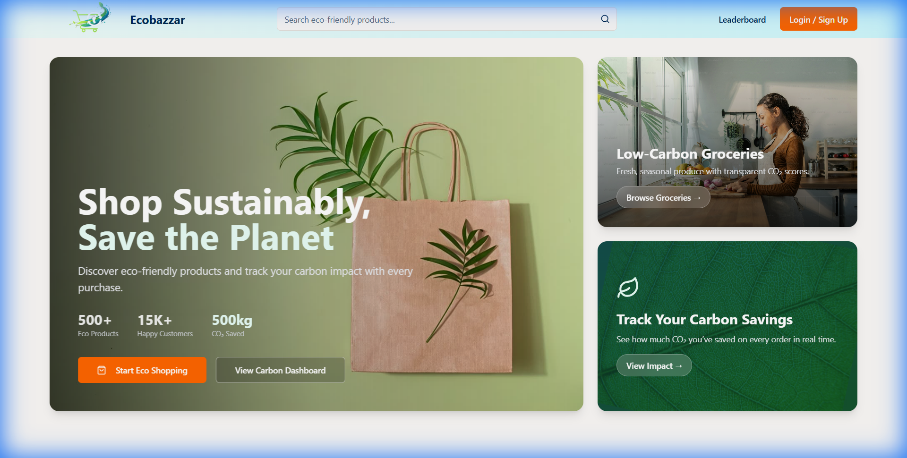

# EcoBazaar – Sustainable E-Commerce with Carbon Impact Transparency 🌿

EcoBazaar is a next-generation e-commerce platform designed to promote sustainable shopping. It integrates carbon footprint tracking and a rewards system to gamify eco-friendly choices.


## 🛑 Problem Statement
Online shopping hides the environmental cost of products. Consumers do not know how much carbon is generated or saved when choosing eco-friendly alternatives, which makes sustainable decision-making difficult.

## 3️⃣ Solution Overview
EcoBazzar is a green e-commerce platform that:
*   **Displays carbon footprint** generated vs carbon saved for each product 📊
*   **Encourages users** to choose eco-friendly alternatives 🌱
*   **Shows real-time CO₂ savings** during checkout and order summary 🛒
*   **Promotes sustainable shopping behavior** without using AI/ML 💡

## 🍃 Key Green Features
*   **Product-level carbon footprint calculation** 🌱: Real-time estimation of CO₂ impact.
*   **Category-based baseline comparison** 🌍: Compares standard products vs. eco-friendly alternatives.
*   **Transport footprint consideration** 🚚: Calculates impact based on delivery distance.
*   **Final CO₂ saved shown clearly to users** 📉: Visual feedback on positive environmental impact.
*   **Carbon points & sustainability awareness indicators** 🏆: Gamifies the experience to encourage green habits.

## ♻️ Environmental Impact
*   Helps users reduce carbon footprint consciously.
*   Encourages eco-friendly purchasing decisions.
*   Visualizes environmental savings in simple, understandable units.
*   Supports long-term sustainable consumption habits.

## 👥 Target Users
*   Environment-conscious consumers.
*   Eco-friendly product sellers.
*   Communities promoting sustainable lifestyles.

## 💡 Why This Fits Green Tech Hackathon
*   Directly addresses carbon footprint reduction.
*   Uses a software-only solution scalable to any e-commerce platform.
*   Promotes environmental awareness through data transparency.
*   Provides tangible green benefits via behavioral nudges.
*   Practical and deployable in real-world scenarios.

## 🛠️ Tech Stack

### Backend
*   **Core**: Java 25, Spring Boot 3.x
*   **Database**: MySQL (with Hibernate/JPA)
*   **Build**: Maven

### Frontend
*   **Core**: React (Vite), TypeScript
*   **Styling**: Tailwind CSS, Shadcn/UI
*   **State**: React Query / Context API

## ⚙️ Setup & Installation

Follow these instructions to run the project locally.

### Prerequisites
*   **Java JDK 25**
*   **Node.js 18+** & **npm**
*   **MySQL Server**

### 1. Database Setup
Create the database in MySQL:
```sql
CREATE DATABASE ecobazaarx;
```
*Tables will be auto-generated on the first run.*

### 2. Backend Setup
Navigate to `ecobazaarx-backend`:
```bash
cd ecobazaarx-backend
./mvnw clean package -DskipTests
java -jar target/ecobazaarx-backend-0.0.1-SNAPSHOT.jar
```
*Server starts on **Port 8090**.*

### 3. Frontend Setup
Navigate to `ecobazaar-hub-main`:
```bash
cd ecobazaar-hub-main
npm install
npm run dev
```
*App is accessible at `http://localhost:5175`.*

## 📸 Application Screenshots

### 🏠 Home Page


### ➕ Add Product (Eco Impact Inputs)


### 📦 Product Details (CO₂ Saved)


### 🛒 Cart Page


### 🚚 Checkout & Order Summary (Final CO₂ Saved)

